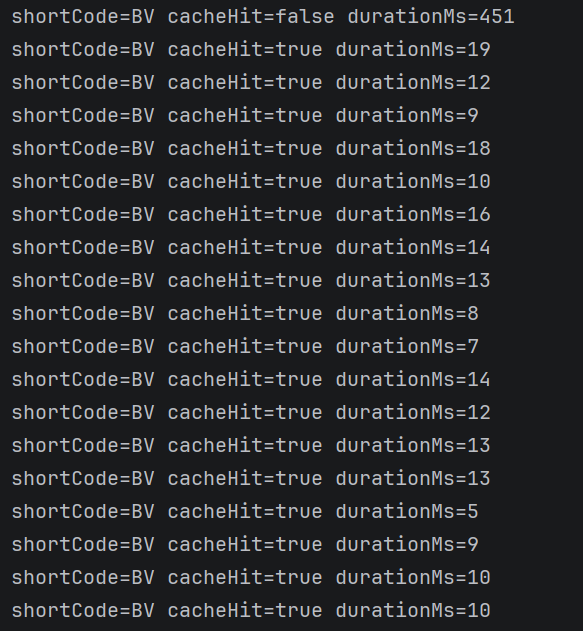

# SnipLink

A URL shortener I built with Spring Boot to actually understand how caching, rate limiting, and auth work under the hood instead of just reading about them.

Live: [sniplink-jap5.onrender.com](https://sniplink-jap5.onrender.com)

## Why I built this

I built SnipLink to get hands-on with the stuff that actually shows up in real life applications— caching, rate limiting under load, JWT auth, and short-code strategy at scale.

## What it does

- Shorten any URL, optionally with a custom alias
- User accounts with JWT-based auth — shortened links are tied to your account if you're logged in, but you can also shorten anonymously
- Per-link analytics (click count, expiry, created date)
- Platform-wide stats (total links created, total clicks)
- Redis-backed caching for redirects (cache-aside pattern) so repeat hits on a popular link don't all go to MySQL
- IP-based rate limiting on the shorten endpoint
- Auto-expiring links with a scheduled cleanup job

## Stack

- **Backend:** Spring Boot 4, Java 21
- **Database:** MySQL (using TiDB Cloud in production, since it's wire-compatible with MySQL and has a genuinely free serverless tier)
- **Cache:** Redis, cache-aside pattern for redirect lookups + rate limiter counters
- **Auth:** JWT (Spring Security 7 + jjwt)
- **Frontend:** Plain HTML/CSS/JS, no framework — served directly by Spring Boot as static resources
- **Deployment:** Docker on Render

## How the short code generation works

Instead of generating a random code and checking for collisions (which gets messy under concurrent writes), I save the URL row first to get an auto-increment ID from the DB, then encode that ID into Base62. It's simple and guarantees uniqueness for free since it's built on the primary key.

The tradeoff — and I know this going in — is that the codes are sequential and predictable. Someone could enumerate `id+1`, `id+2` and guess other shortened URLs. Fine for a portfolio project, not something I'd ship as-is for a product handling private links. A hash-based or pre-generated random-code-pool approach would fix this, at the cost of needing a uniqueness check per insert.

## Known rough edges

Being upfront about these since I found them while stress-testing my own reasoning, not because someone else pointed them out:

- **Rate limiter is a fixed window, not sliding.** A user can send their max allowed requests right at the end of one window and again right at the start of the next, effectively doubling the limit in a short burst. A sliding window or token bucket would fix this — I know the tradeoff, just haven't rebuilt it yet.
- **No refresh token / logout flow.** JWTs are issued on login and just expire — there's no way to invalidate a token early (e.g., on logout, or if one leaks). A refresh-token + short-lived-access-token setup, or a server-side denylist, is the real fix.
- **Rate limiter reads the raw connection IP**, which will misbehave behind a reverse proxy / load balancer (like Render's) since every request looks like it's coming from the same internal IP. Needs to read `X-Forwarded-For` instead once actually deployed behind a proxy.

I'd rather list these myself than have someone find them and assume I don't know they're there.

## Performance

I instrumented the redirect endpoint to measure the actual impact of the Redis cache-aside layer, rather than assuming it helps:

```java
long start = System.nanoTime();
boolean cacheHit = cacheManager.getCache("urls").get(shortCode) != null;
Optional<Url> url = service.getUrl(shortCode); // @Cacheable — DB only runs on miss
long durationMs = (System.nanoTime() - start) / 1_000_000;
log.info("shortCode={} cacheHit={} durationMs={}", shortCode, cacheHit, durationMs);
```



Tested locally (not on the deployed Render instance) to isolate the DB-vs-cache difference from network latency and Render's cold starts. Results, averaged over multiple runs against a warm JVM and local MySQL instance:

| | Latency |
|---|---|
| First-ever query (cold connection pool) | ~450ms |
| Steady-state DB lookup (cache miss) | ~10-20ms |
| Steady-state Redis lookup (cache hit) | ~6-9ms |

**Takeaway:** on a small local dataset, MySQL is already fast, so the cache only buys ~30-40% in this environment — nowhere near the dramatic numbers you'd see on a first cold-start comparison, and I'm not going to pretend otherwise. The gain would be more meaningful in production, where the DB is a network hop away on TiDB Cloud rather than sitting on localhost, and at a scale where indexed lookups aren't already trivially fast. What this test *does* confirm is that the cache-aside logic is working correctly end-to-end (verified via the `cacheHit` flag, not just faster timings that could be coincidental) and consistently removes the DB round-trip on every repeat hit.

## Running it locally

You'll need MySQL and Redis running locally.

```bash
git clone https://github.com/Anuj0725/Url-Shortener.git
cd Url-Shortener
```

Set these environment variables (or just let the defaults in `application.properties` point at `localhost`):

```
DB_USERNAME=your_mysql_user
DB_PASSWORD=your_mysql_password
JWT_SECRET=any_long_random_string
```

Then:

```bash
./mvnw spring-boot:run
```

App runs on `http://localhost:8080` — the frontend is served from the same origin, no separate setup needed.

## Deployment

Runs in Docker on Render, with TiDB Cloud for MySQL and Render's Key Value for Redis. Dockerfile's in the repo root if you want to see the exact build.